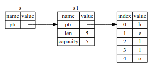
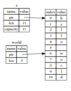

## purpose of ownership
  - 对什么代码使用了heap上的那些数据进行持续跟踪
  - 最小化heap上的重复数据
  - 清除无效数据,避免空间不足

## stack and heap
1. **stack**
  - 后进先出方式
  - 所有存储在stack上的都是编译器就已知固定大小数据.
  - 向stack上加数据比向heap上快,因为往栈上添加数据总是放在栈顶.不需要去搜索内存空间.
  - 从stack上访问数据比heap上快,因为访问heap数据需要先拿到指针,然后去取指针指向的数据

2. **heap**
  - 存放编译期无法确定大小,或者大小可变的数据.
  - 向操作系统请求一定大小的内存,标记该内存为 being in use,并返回指向改地址指针的过程叫做 allocating on the heap 或者简称 allocating.
  - 返回的指针是固定大小的数据结构,因此可以放在栈上

3. **调用函数时**
  - 调用函数时，相关的数据被压入stack
  - 函数运行结束后，相关的数据又被弹出stack
  - 这些数据包括：
    - 传递给函数的数据，可能包括指向heap内存的pointer
    - 函数内的local变量

## Ownership rules
1. Rust中每个数据都有对应的变量,这个变量就是这个数据的owner
2. 一个数据同一时刻只能有一个owner
3. 当ower离开相应的作用域时,数据被销毁

## scope 作用域
和C语言一样,Rust使用{}来定义作用域,当变量在作用与内他是有效的,出了作用域则是无效的

## 栈中变量与堆中数据互动方式
1. **move** move语义会转移对象所有权 move首先copy原有变量在栈中的结构(pointer,length,capacity等) ,同时失效原有变量. move 也可以称为shallow copy(浅拷贝)
2. **clone** clone方法不会更改对象所有权.clone对应deep copy(深拷贝),会同时copy对象栈和对的数据结构.

stack-only data 变量数据的互动方式
1. **copy** copy语义不会使原有变量失效,copy语义也不会用在有ownership的变量上.
Here are some of the types that are Copy:
  - All the integer types, such as u32.
  - The Boolean type, bool, with values true and false.
  - All the floating point types, such as f64.
  - The character type, char.
  - Tuples, if they only contain types that are also Copy. For example, (i32, i32) is Copy, but (i32, String) is not.d

## reference
reference是为了让我们使用数据,而不改变数据的ownership而产生的.有以下类型
1. Shared reference `&`
2. Mutable reference `&mut `

rule of reference
  - 在任意时刻,要么有一个mutable reference, 要么有多个immutable reference(shared reference)
  - reference 必须总是可用的

## slice
slice 也同样不会改变原有数据的ownership, 和reference类似,slice只引用目标数据的一部分内容

